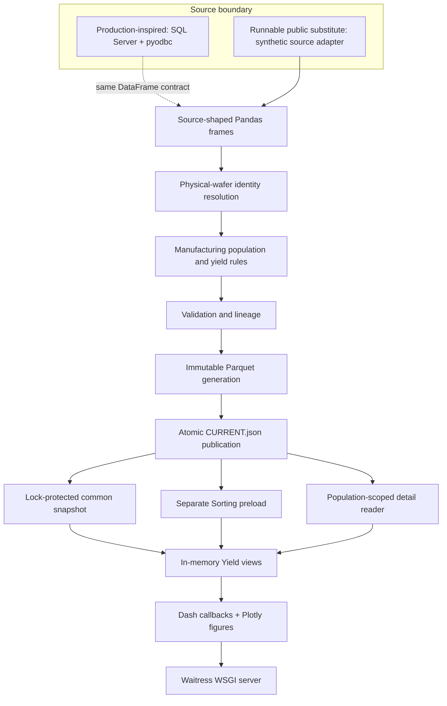
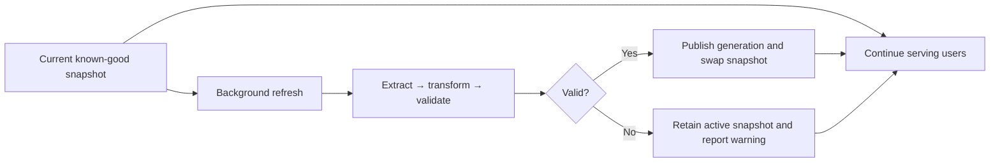

# Architecture

This document answers: **“Walk me through the system and explain why the layers exist.”**

The architecture is a clean-room analogue of a production Yield Dashboard. It preserves the
implemented patterns and tradeoffs while using independently written code and fictional data.

## Current public architecture

## Layer responsibilities

### Source boundary

[`sources.py`](src/manufacturing_analytics/sources.py) returns source-shaped DataFrames rather than
already-correct metrics. The public synthetic adapter deliberately includes different identifiers,
wafer and chip grains, revisions, different event dates, ambiguous aliases, and high-volume
parameter detail.

`SqlServerManufacturingSource` shows the completed production-inspired access boundary:
parameterized SQL through a lazily imported `pyodbc`. Its public query names are fictional and it
contains no connection details. It is not presented as a runnable production connector.

### Pandas transformation

[`transforms.py`](src/manufacturing_analytics/transforms.py) owns the interpretation work:

- exact and normalized alias matching;
- explicit ambiguous and unresolved dispositions;
- latest-revision selection;
- source-specific event-date selection;
- wafer-grain and chip-grain denominators;
- complete physical-wafer cohorts;
- component and quantity-weighted yield;
- failure attribution and record lineage.

This layer exists because changing an engineering calculation should not require rewriting the
Dash callbacks or the Parquet publication mechanism.

### Prepared analytical storage

[`storage.py`](src/manufacturing_analytics/storage.py) writes one generation directory containing:

- common Yield and failure facts;
- wafer summaries and final component facts;
- prebuilt trend and Pareto datasets;
- identity audit and lineage;
- targeted chip and Sorting detail;
- a manifest with schema version, columns, row counts, load policy, statistics, and status.

Files are written beneath a temporary generation directory. Validation must succeed before the
directory is promoted and `CURRENT.json` is atomically replaced. Retained valid generations provide
a fallback if the pointer or newest generation is damaged.

### Runtime state and refresh

[`runtime.py`](src/manufacturing_analytics/runtime.py) separates persisted data from active server
state:

- `SnapshotManager` swaps a complete common generation under a lock.
- `RefreshCoordinator` extracts, transforms, validates, publishes, and then swaps.
- `SortingPreload` builds its expensive common analysis on a separate cycle.
- `GenerationWatcher` hot-loads externally published generations without a server restart.
- `TargetedDetailRepository` reads only selected physical-wafer detail.

The active snapshot is never cleared while a replacement is being built.

### Analytical views

[`yield_analytics.py`](src/manufacturing_analytics/yield_analytics.py) performs fast filtering and
aggregation over the active common snapshot. It builds the Yield matrix, selected-period Pareto,
full-range trend, physical-wafer scatter, traceability table, and export population.

The module requests detailed records only after a selected period has narrowed the physical-wafer
population.

### Dash application

[`application.py`](src/manufacturing_analytics/application.py) owns layout and interaction:

1. filter the broad Yield matrix;
2. select one period cell;
3. open Enhance without discarding the selected context;
4. inspect Pareto, trend, and physical-wafer variation;
5. select a wafer to retrieve its detail;
6. export the exact population.

The application factory accepts a URL base path so the Dash WSGI application can be mounted beneath
a larger Flask application portal. [`main.py`](src/manufacturing_analytics/main.py) serves the
standalone public application with Waitress.

## Workload separation

| Data path | Trigger | Held in memory | Persisted | Failure behavior |
| --- | --- | --- | --- | --- |
| Common Yield snapshot | startup, scheduled refresh, manual refresh, generation watch | Yes | Parquet generation | previous snapshot remains active |
| Prebuilt trend/Pareto | common refresh | Yes | Parquet generation | previous common snapshot remains active |
| Sorting parameter summary | separate background preload/cadence | Summary only | raw detail in Parquet | previous preload retained |
| Chip/Sorting detail | selected physical wafer | No broad preload | targeted Parquet fact | current common view remains usable |

## Configuration

[`default.json`](config/default.json) controls runtime, generation retention, refresh cadence,
synthetic volume, and display defaults. [`yield_rules.json`](config/yield_rules.json) controls the
fictional row hierarchy, identity policy, and final-yield cohort requirements.

Configuration is deliberately JSON because the reference applications use shared, editable JSON
for changing operational and engineering behavior. The public files contain only fictional rules.

## Concurrency assumptions

- One in-process refresh writer is protected by a non-blocking lock.
- Snapshot publication is a short lock-protected assignment after all expensive work finishes.
- Parquet publication has a separate writer lock and an atomic pointer replacement.
- Sorting preload has its own refresh lock and does not block common publication.
- Waitress provides multiple request threads for the server-hosted application.

This design mirrors a single Windows-hosted internal application service. Distributed coordination
is not claimed and would require a different design.

## Production current, historical, and future

### Direct analogues of current completed behavior

SQL Server/`pyodbc`, parameterized source pulls, Pandas transformations, Dash/Plotly, shared JSON,
in-memory snapshots, preloads, separate expensive-data cycles, targeted retrieval, Parquet
generations, background refresh, last-known-good behavior, Waitress, and portal mounting.

### Historical modes represented in documentation

Engineering/development scripts, local Dash servers, packaged desktop/pywebview behavior, versioned
application distribution, and centrally installed applications preceded the server-hosted model.
They are part of the evolution story, not additional runtime modes in this public app.

### Future or deliberately excluded

A real SQL Server deployment of this public code, multi-process/distributed cache coordination,
cloud hosting, containers, Redis, PostgreSQL, DuckDB, microservices, and AI features are not current
features. They are not needed to explain the work represented here.

## Clean-room boundary

The design mirrors categories of behavior—not private implementation. No private SQL, schema,
hostname, address, path, product, process identifier, failure code, business-rule threshold,
credential, screenshot, or production value appears in this repository.
