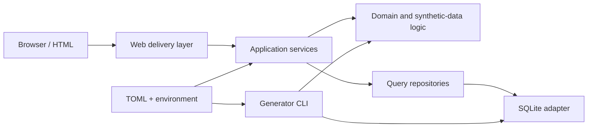

# Architecture

## Context

This repository is a clean-room portfolio project. It contains only fictional names, relationships, rules, and generated data. The first iteration creates stable boundaries before adding sophisticated analytics.

## Layers and responsibilities

### Domain

`domain/` owns manufacturing concepts that do not depend on HTTP or SQLite. The synthetic generator lives here because its correlations and constraints describe the fictional manufacturing world. A fixed seed makes failures reproducible.

### Data

`data/` owns schema creation, transactions, loading, and read queries. Raw SQL is intentional in Phase 1: reviewers can see keys, constraints, indexes, joins, and transaction boundaries directly. `Database` is infrastructure; `ManufacturingRepository` expresses queries in application language.

### Services

`services/` coordinates workflows. The bootstrap use case initializes an empty database and generates the demo dataset without putting orchestration in a web route.

### Web

`web/` translates HTTP requests into application calls and renders responses. Routes do not generate data or write SQL. Server-rendered HTML keeps the initial application shell small and accessible; richer client-side visualization can arrive when real interactions exist.

### Composition root

`main.py` wires settings, persistence, repositories, lifecycle behavior, and routes. Centralized wiring makes dependencies visible and gives tests a straightforward application factory.

## Cross-cutting concerns

- Configuration uses checked-in TOML defaults and narrow environment overrides.
- Logging is configured once and uses structured, timestamped operational messages.
- Database loads are transactional; failures roll back rather than leave a partial dataset.
- Foreign keys, uniqueness constraints, checks, and indexes protect model integrity.
- Tests use isolated temporary databases and deterministic seeds.

## Deployment direction

The current process is suitable for local development. A production deployment would run behind a reverse proxy, use an externally managed relational database, generate immutable assets during build, perform migrations separately from startup, and run refresh work in a dedicated worker. Health checks, secrets injection, telemetry, backup policy, and resource limits should be part of that deployment—not afterthoughts in application routes.

## Intended evolution

Interfaces should be added only where a second implementation or testing seam earns them. Likely future boundaries include an analytics query service, cache backend, refresh scheduler, and production database adapter. The repository deliberately avoids introducing those abstractions before their behavior exists.

