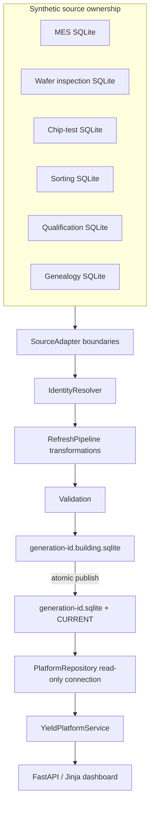

# Architecture

## Architectural objective

The system separates source-system work from interactive work. Heterogeneous operational records are reconciled and transformed once per refresh; dashboard requests query one validated, read-optimized generation.



## Layers and responsibilities

### Source adapters

Each adapter owns one fictional schema and extraction contract. Adapters return source-shaped rows and watermarks; they do not know canonical joins or yield rules. The separate SQLite files make it impossible to accidentally query the sources as one warehouse.

### Identity reconciliation

`IdentityResolver` builds a multi-map from genealogy aliases. Resolution may be exact, composite, fallback, unresolved, or ambiguous. Only a unique match becomes a canonical wafer. Other results become explicit transformation issues instead of null-tolerant joins.

Canonical hierarchy:

```text
Work Order → Lot → Wafer / Substrate → Die / Device
```

### Transformation

`RefreshPipeline` owns cross-source coordination. It normalizes process families and dates, determines completion, applies production exclusions, retains latest revisions, evaluates stage-specific pass criteria, maps failure families, and assigns analytical periods. Rules that change independently of code live in TOML; structural invariants stay in Python and tests.

### Canonical analytical model

The central `stage_population` table uses a common traceability envelope while retaining `population_unit` (`WAFER`, `DIE`, or `SAMPLE`). A row separately records denominator membership, pass/fail, failure family, and exclusion reason. This prevents exclusion from being encoded as deletion and prevents grains from being silently combined.

`analytical_lineage` has at least one row per analytical population row. It records source system, source table, source key, reconciliation method, and transformation explanation.

### Generation store

Refresh writes a unique `.building.sqlite` file. Integrity, metadata state, and minimum population checks run before publication. The file is renamed to its immutable final name, then `CURRENT.next` atomically replaces `CURRENT`. Readers resolve the pointer for each read-only connection. A failed build never changes the pointer.

### Serving and UI

`PlatformRepository` permits only parameterized reads from the current generation. `YieldPlatformService` composes stage metrics, trend, Pareto, and wafer summaries. Routes render prepared results and CSV exports; they never invoke extraction or ETL.

The Phase 1–3 normalized database remains behind separate repositories for supporting wafer-map, SPC, operations, and data-quality examples. It is not the flagship dashboard's source of truth.

## Workload boundary

| Workload | Trigger | Reads | Writes |
| --- | --- | --- | --- |
| Source generation/extraction | setup or scheduled refresh | isolated sources | source files/building generation |
| Reconciliation/transformation | scheduled refresh | extracted source rows/config | building generation |
| Validation/publication | refresh completion | building generation | immutable generation + pointer |
| Interactive investigation | HTTP request | current generation only | none |

## Failure model

- Unresolved/ambiguous identities are quarantined and counted.
- Duplicate/revised rows receive explicit dispositions.
- Incomplete wafers remain visible and are excluded downstream.
- A pipeline exception removes the building artifact and preserves `CURRENT`.
- Readers use a known-good immutable file, avoiding partial-refresh visibility.
- Source row counts, warning counts, timestamps, and publication status are visible in the UI.

## Tradeoffs

SQLite provides reproducibility, transactions, read-only connections, and file-level atomic publication. It does not provide distributed writers, cloud object-store semantics, or columnar execution. The next storage decision should follow measured volume and concurrency—not a desire to add fashionable infrastructure.

The scheduler is intentionally an in-process seam, not a daemon. It proves due-time behavior and pipeline separation. Production deployment would place orchestration, retries, locking, alerting, and retention in an external worker/scheduler.
