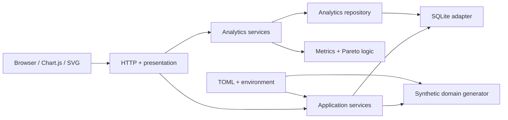

# Architecture

## Context

This clean-room portfolio project contains only fictional names, relationships, rules, and generated data. Phase 2 extends the foundation into a connected investigation workflow without turning routes or templates into analytics engines.

## Dependency direction

### Domain

`domain/` owns deterministic manufacturing behavior and reusable calculations. Coordinate generation, weighted-yield validation, and Pareto calculations do not import FastAPI, Jinja, or SQLite.

### Data

`data/` owns schema creation, transaction boundaries, loading, and SQL. `AnalyticsRepository` builds filter-aware queries from an allowlisted set of clauses and binds all user values as SQL parameters. It returns records rather than presentation objects.

Explicit SQL remains intentional: hiring reviewers can inspect joins, aggregation level, indexes, constraints, and cohort behavior directly. An ORM would add mapping machinery without removing the need to reason carefully about analytical grain.

### Analytics

`analytics/` defines investigation inputs and metric workflows. `AnalyticsFilters` is the canonical cohort definition. `AnalyticsService` defines weighted yield, distribution bands, the tool-comparison operation, drill-down composition, and lightweight query timing. This is the boundary where multiple repository queries become one use case.

### Application services

`services/` coordinates startup workflows. Bootstrap initializes an empty schema and rebuilds the deterministic dataset when coordinate data is absent. Generated data is disposable; user data is never managed by this workflow.

### Web and presentation

`web/` handles request parsing, response codes, context serialization, and rendering. Routes do not contain SQL or statistical calculations. Jinja templates render Chart.js comparisons and retain tables for the core drill-down and Pareto outputs. The wafer map is server-rendered SVG because the geometry is small, coordinate-native, inspectable, and interactive without a second application framework.

### Composition root

`main.py` wires settings, persistence, repositories, services, lifecycle behavior, routes, and static assets. Tests can replace only the database path while exercising the same dependency graph used by the application.

## Metric definitions

- **Weighted yield:** sum of passing die divided by sum of tested die for the filtered wafer cohort.
- **Wafer count:** distinct wafers having a final synthetic yield result in the cohort.
- **Lot/work-order count:** distinct parent entities represented by those wafers.
- **Tool comparison:** final wafer yield grouped by exposure to each tool at the selected operation. The default is the fictional etch operation (`OP-400`).
- **Defect contribution:** classified inspection defects in a category divided by all classified defects in the cohort.

The time filter applies to the final yield-result timestamp. Tool and operation filters mean the wafer had that process exposure; they do not imply that the exposure caused the final outcome.

## Performance and evolution

Every important analytics repository call is timed with `perf_counter` and logged as `analytics_query`. The service retains a bounded in-process diagnostic history for tests and local benchmarking. This is instrumentation, not caching.

See [docs/PERFORMANCE.md](docs/PERFORMANCE.md) for the dataset baseline and optimization candidates. Likely future seams include precomputed time/product/lot aggregates, an external cache, a background refresh worker, and a PostgreSQL adapter. They should be introduced against measured workloads and explicit freshness requirements.

## Deployment direction

A production deployment would run behind a reverse proxy, use PostgreSQL and versioned migrations, generate immutable assets during build, run refresh work in a dedicated worker, and inject secrets from the deployment environment. Health/readiness checks, structured JSON logs, metrics, traces, backup policy, resource limits, Content Security Policy, and a locally bundled chart asset should be addressed before an internet-facing deployment.
