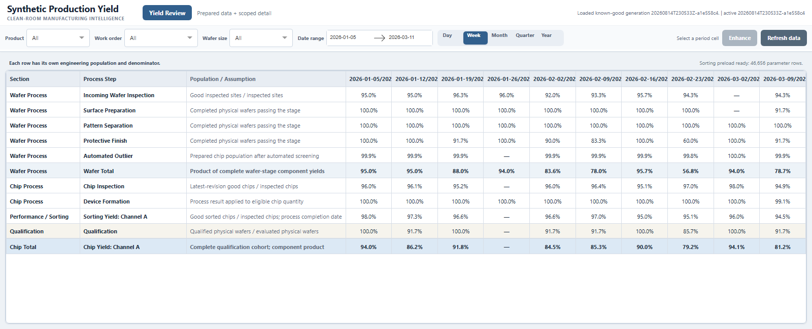
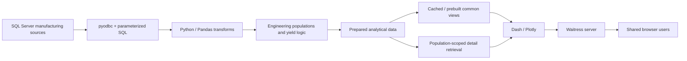
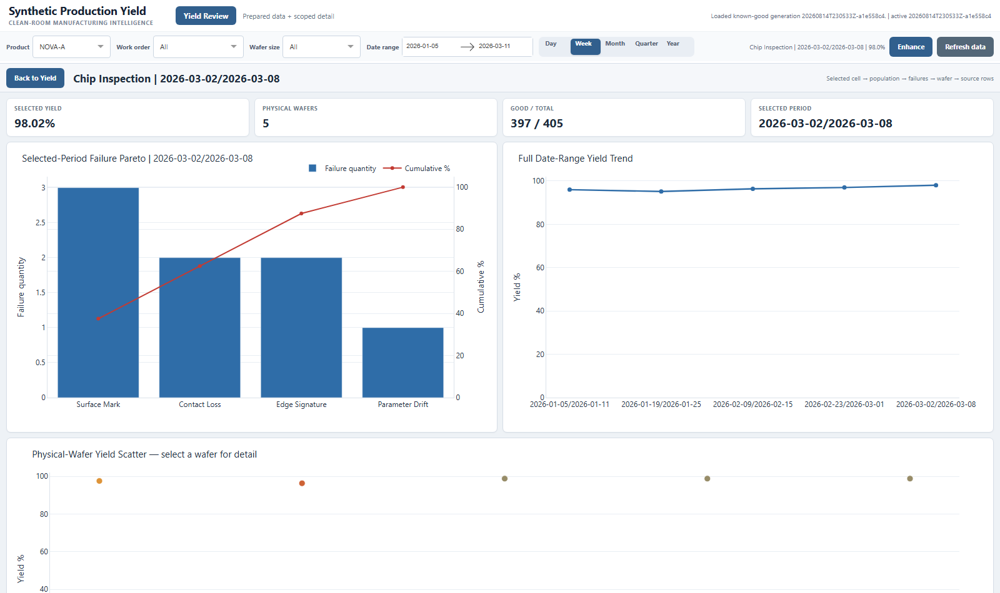

# Manufacturing Analytics Platform

## Semiconductor Yield Engineering, Data Architecture, and Application Delivery

I built a semiconductor manufacturing yield analytics platform that evolved from SQL/Python engineering analysis into a centrally hosted application for production review and root-cause investigation. As adoption and data volume grew, I redesigned the system around scoped data retrieval, reusable analytical snapshots, background refresh, targeted drilldowns, and centralized hosting so engineers could move from factory-level yield trends to individual-wafer evidence without rebuilding the analysis each time.

This project demonstrates the intersection of manufacturing engineering, software development, data architecture, performance optimization, and production application support.

> **Broader portfolio:** For additional work in process analytics, Lean digital operations, and manufacturing application delivery, see the [Manufacturing Software Portfolio](https://github.com/4sy8zwp9hz-netizen/manufacturing-software-portfolio).



## What I built

The platform turns fragmented manufacturing records into traceable yield populations and interactive engineering workflows. Its scope includes:

- SQL Server-compatible source access and parameterized retrieval
- Python/pandas transformations across wafer, chip, inspection, qualification, and sorting data
- explicit physical-wafer identity resolution and analytical cohort construction
- table-first Yield review with Pareto, trend, wafer scatter, lineage, and export
- targeted wafer and parameter drilldown instead of broad high-volume retrieval
- cached and prebuilt common views for low-latency interaction
- separately scheduled preparation for expensive reusable analysis
- validated Parquet generations with atomic publication
- background refresh with last-known-good behavior after source or rebuild failure
- Dash/Plotly presentation, Waitress hosting, and portal-ready application composition
- JSON-driven display, identity, cohort, runtime, and refresh behavior

The public repository is runnable with deterministic synthetic semiconductor data while preserving the same architectural problems and engineering contracts.

## The manufacturing problem

Raw production records do not directly equal an engineering yield metric. Different systems can identify the same physical wafer differently, operate at wafer or chip grain, use different event dates, contain revisions, and represent different manufacturing populations.

A useful yield application therefore has to answer more than “what percentage passed?” It must establish:

- which physical wafers belong to the population;
- which event date places each result in a reporting period;
- which denominator applies to each process stage;
- which failures caused the loss;
- which underlying records support the displayed result.

The difficult part was building a trustworthy analytical population and making it explorable at interactive speed.

## Architecture



The architecture separates source access, manufacturing interpretation, prepared data, interactive analytics, and hosting so each layer can evolve independently.

[View detailed architecture](ARCHITECTURE.md)

## How the system evolved

The final architecture was not designed up front. Each successful stage exposed the next constraint.

| Stage | New problem | Engineering response |
| --- | --- | --- |
| Engineering analysis | Source records were not usable as engineering populations | SQL plus pandas transformation |
| Repeated investigation | Manual analysis had to be rebuilt | Dash/Plotly application |
| User adoption | Local copies became difficult to distribute and maintain | Versioned releases and centralized access |
| More data | Broad queries and repeated calculations slowed startup and interaction | Query scoping, caching, and precomputation |
| Expensive analysis | Not every dataset belonged on the startup path | Lazy detail, background prebuild, and separate preload cycles |
| Shared use | Per-user processing duplicated the same database work | Central server hosting |
| Repeated source work | Common analytical populations were rebuilt repeatedly | Scheduled ETL and prepared Parquet data |
| Refresh failure | A failed rebuild could not take down a working view | Last-known-good snapshot retention |

[Read the engineering evolution](docs/ENGINEERING_EVOLUTION.md)

## Selected engineering challenges

### 1. Defining the correct manufacturing population

Source-row count is not manufacturing truth. Wafer, chip, inspection, qualification, and sorting records use different identifiers, dates, grains, and revision behavior. I normalized those relationships into explicit analytical populations so each displayed yield value has a defensible numerator, denominator, and lineage path.

### 2. Reducing broad retrieval

Early investigation paths could retrieve far more history than a selected wafer population required. I changed expensive paths to resolve the selected work-order and wafer population first, then retrieve or scan only the relevant detail.

### 3. Moving work out of the user interaction path

As history and adoption grew, startup and common clicks could not keep rebuilding the same data. Shared populations and frequently reused analyses moved into prepared snapshots, memory caches, and background prebuilds so browser interactions mostly filter completed state.

### 4. Separating common and specialized workloads

Common yield views are reused constantly, while chip-level and parameter detail may be large and only needed after a narrow selection. The platform uses eager preparation for common facts, separate background cycles for expensive reusable summaries, and targeted reads for highly detailed evidence.

### 5. Making refresh failure non-destructive

A source or rebuild failure should not replace a valid production view with an error or partial dataset. New generations are built and validated separately, then published atomically. If refresh fails, the previous valid generation remains active and the application reports the stale or failed state.

## Data-access strategy

| Workload | Strategy | Why |
| --- | --- | --- |
| Common Yield population | Refresh, transform, publish, preload | Used by normal filters and table interactions |
| Expensive but common Sorting analysis | Separate background preparation | Keeps specialized work from blocking common refresh |
| High-volume chip/parameter detail | Population-scoped targeted read | Avoids loading unrelated detail into memory |

See [Data Flow](docs/DATA_FLOW.md) and [Performance Evolution](docs/PERFORMANCE_EVOLUTION.md).

## What this project demonstrates

For a technical reviewer, the important story is not the charts themselves. It is the progression from a manufacturing question to a supportable software system:

- translating physical manufacturing logic into explicit data contracts
- debugging ambiguous identity, date, grain, and cohort problems
- choosing different retrieval and caching strategies for different workloads
- evolving a local engineering tool into shared server-hosted software
- treating freshness, observability, recovery, and failure behavior as product requirements
- working across manufacturing, database, application, server, and IT boundaries

This is the type of work I enjoy most: starting with an ambiguous operational problem, building something useful quickly, then engineering the surrounding system as real usage exposes the next bottleneck.

## Explore the application



The main workflow is intentionally close to how an engineer investigates production yield:

1. Filter the summary by product, work order, wafer size, date, or period grain.
2. Select a period cell in a Yield row.
3. Choose **Enhance**.
4. Inspect the selected-period Pareto and full-range trend.
5. Select a physical wafer in the scatter plot.
6. Retrieve only that wafer's chip or Sorting detail.
7. Export the exact selected analytical population.
8. Trigger a refresh while the current valid screen remains available.

## Repository structure

```text
config/
  default.json               runtime, storage, refresh, and display settings
  yield_rules.json           fictional identity, cohort, and row definitions
src/manufacturing_analytics/
  sources.py                 synthetic substitute and optional SQL Server boundary
  transforms.py              identity, population, yield, and lineage logic
  storage.py                 Parquet generations and targeted detail reads
  runtime.py                 snapshots, refresh, preload, and hot reload
  yield_analytics.py         in-memory tables, figures, and drilldown views
  application.py             Dash layout and callbacks
  bootstrap.py               service composition and background loops
  main.py                    Waitress entry point
tests/                       behavioral and failure-path contracts
tools/capture_screenshots.py browser capture from the running application
docs/                        architecture and engineering evolution documents
```

## Run locally

Python 3.11 or newer is required.

```powershell
py -m venv .venv
.venv\Scripts\Activate.ps1
python -m pip install -e ".[dev]"
python -m manufacturing_analytics.scripts.refresh_data
python -m manufacturing_analytics.main
```

Open `http://127.0.0.1:8050`.

The server loads the most recent valid generation. If no generation exists, it creates one from the synthetic adapter. Generated files live beneath `data/yield_runtime/` and are ignored by git.

## Verification

```powershell
python -m pytest
python -m ruff check .
python -m ruff format --check .
```

Tests cover source grains, identity ambiguity, revisions, cohort consistency, quantity weighting, lineage, Parquet validation, atomic publication, injected refresh failures, known-good fallback, separate Sorting preload behavior, population-scoped detail, Dash layout, and health reporting.

## Engineering documentation

- [Architecture](ARCHITECTURE.md)
- [Yield Calculation Model](docs/YIELD_CALCULATION_MODEL.md)
- [Engineering Evolution](docs/ENGINEERING_EVOLUTION.md)
- [Performance Evolution](docs/PERFORMANCE_EVOLUTION.md)
- [Deployment Evolution](docs/DEPLOYMENT_EVOLUTION.md)
- [Engineering Terminology](docs/ENGINEERING_TERMINOLOGY.md)
- [Truthfulness Audit](docs/TRUTHFULNESS_AUDIT.md)

## Public implementation and confidentiality

This repository is an independently written clean-room implementation of the architecture and engineering lessons from a production semiconductor Yield Dashboard I developed. It uses fictional products, identifiers, process stages, failure categories, rules, values, and synthetic data.

No employer source code, SQL, schemas, credentials, network details, production data, screenshots, or confidential operating rules are published here. The synthetic source adapter replaces private production systems while preserving the data-shape and architecture challenges needed to make the project technically meaningful.

## License

[MIT](LICENSE)
