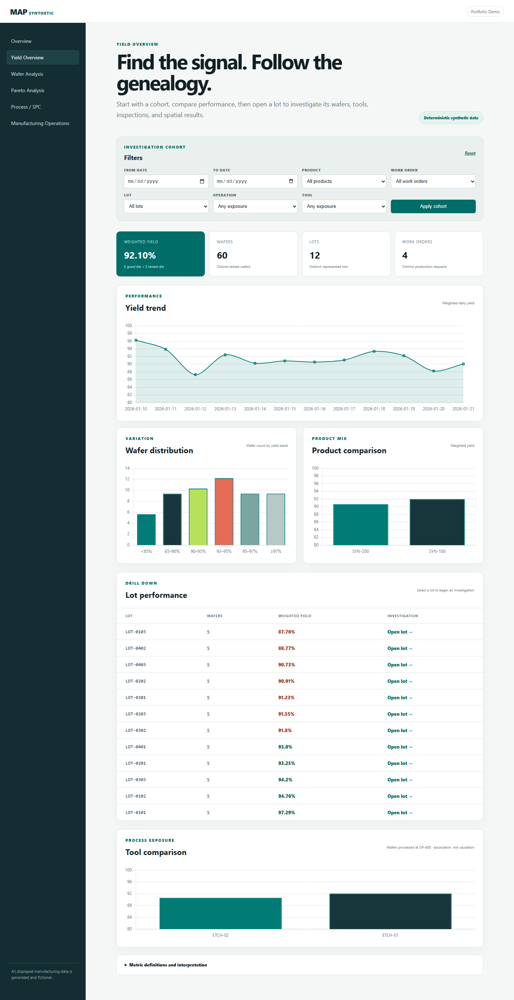
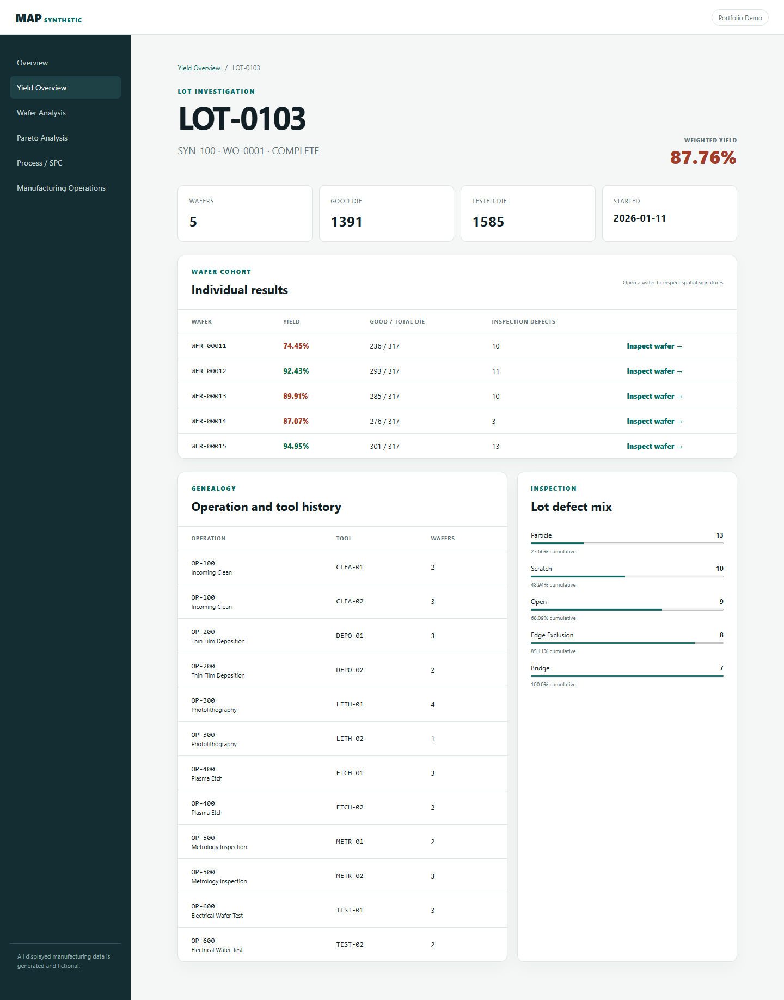
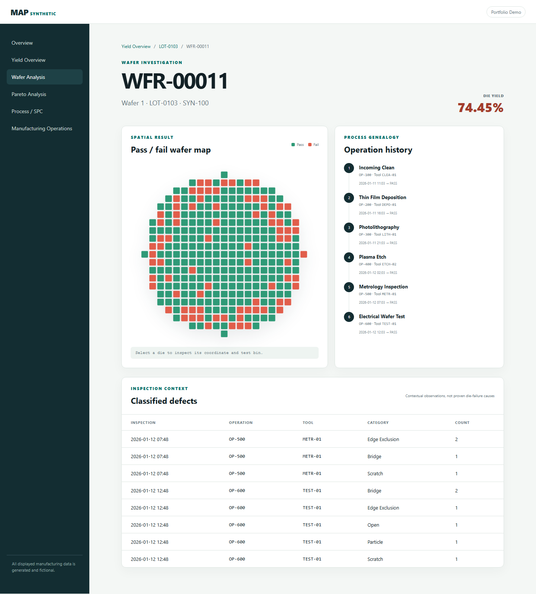
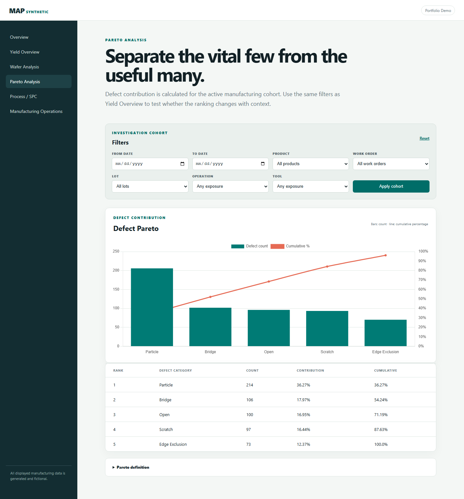

# Manufacturing Analytics Platform

[](https://www.python.org/)
[](LICENSE)

A production-style Python investigation tool for semiconductor manufacturing analytics using **entirely synthetic data**.

> **Clean-room portfolio project:** no proprietary source code, company schemas, table names, credentials, business rules, or production data are used or referenced. Every identifier, relationship, distribution, spatial pattern, and process effect is fictional.

## The manufacturing problem

A yield number is only the start of an investigation. An engineer needs to define the affected cohort, identify degraded lots, compare individual wafers, inspect spatial signatures, trace operation and tool history, and use defects as supporting context.

This project implements that connected path:

```text
Yield signal → filtered cohort → lot → wafer map → process genealogy → tool comparison → defect Pareto
```

Phase 2 prioritizes a coherent workflow over a gallery of unrelated charts. A filter model and analytics service keep every page aligned on the same cohort and metric definitions.

## Investigation experience

### Yield Overview



Weighted yield, cohort counts, time trend, wafer distribution, lot and product comparisons, and operation-aware tool comparison. Product, work-order, lot, date, operation, and tool filters use parameterized analytics queries.

### Lot investigation



Selecting a lot preserves the investigation context and exposes individual wafer yield, inspection counts, operation/tool history, and the lot defect mix.

### Wafer map



Each wafer contains 317 unique coordinate results. The interactive SVG map exposes pass/fail status and fictional test bin while the adjacent genealogy connects the wafer to the tools used.

### Defect Pareto



The filter-aware Pareto combines classified defect counts, percentage contribution, and cumulative percentage. Statistical calculations live in the domain layer and have focused unit tests.

## Investigation Walkthrough

One fictional walkthrough using the configured seed:

1. Open **Yield Overview** and note the weighted baseline and wafer-yield distribution.
2. Compare lots and open `LOT-0103`, a cohort containing visibly lower-yield wafers.
3. Select `WFR-00011`; the wafer map makes its edge-heavy failure signature visually apparent.
4. Review the wafer genealogy, then return to the overview and compare tools at `OP-400`.
5. Observe that the synthetic `ETCH-02` cohort trends lower than `ETCH-01`, then use product, time, and lot filters to see whether the association persists.
6. Check the Pareto and inspection context to prioritize follow-up—not to declare root cause.

This sequence supports a hypothesis about a fictional process/tool relationship. It does **not** prove causation. A real investigation would check confounding, sampling, metrology, maintenance history, temporal ordering, repeatability, and designed experiments.

## Architecture

- **Domain:** deterministic coordinate generation, yield validation, and Pareto math
- **Data:** relational schema, transactions, parameterized analytics SQL, and indexes
- **Analytics:** canonical filters, metric definitions, investigation workflows, and timing
- **Services:** safe local bootstrap of reproducible generated data
- **Web:** HTTP validation, status codes, context serialization, and presentation
- **Composition:** explicit startup wiring and application lifecycle

Routes contain no SQL; templates calculate no manufacturing statistics. See [ARCHITECTURE.md](ARCHITECTURE.md), [DATA_MODEL.md](docs/DATA_MODEL.md), and [PERFORMANCE.md](docs/PERFORMANCE.md).

## Technology stack

| Concern | Choice | Rationale |
| --- | --- | --- |
| Runtime | Python 3.11+ | Type hints, `tomllib`, broad deployment support |
| Web | FastAPI + Jinja2 | Testable application factory without a frontend build system |
| Charts | Chart.js 4 | Focused interactive comparisons with accessible data tables |
| Wafer map | Server-rendered SVG | Coordinate-native, inspectable, and lightweight interaction |
| Storage | SQLite + explicit SQL | Zero-service setup and transparent relational/query design |
| Tests | pytest + HTTPX | Isolated behavior and end-to-end route validation |
| Quality | Ruff | Consolidated linting and import checks |
| CI | GitHub Actions | Python 3.11/3.12 lint, tests, and generator exercise |

## Synthetic data model

```text
Work order → lot → wafer → operation/tool history
                    ├── inspection → classified defects
                    └── yield result → coordinate-level die results
```

The generator embeds deterministic uniform, edge-degradation, localized-cluster, and random-loss wafer signatures plus a modest fictional tool effect. Aggregate yield is calculated from coordinate results, preventing disagreement between the KPI and wafer map.

## Quick start

```bash
python -m venv .venv
```

Activate the environment, then:

```bash
python -m pip install -e ".[dev]"
python -m manufacturing_analytics.scripts.generate_data
uvicorn manufacturing_analytics.main:app --reload
```

Open <http://127.0.0.1:8000/analytics/yield-overview>.

Run quality checks and the timing baseline:

```bash
pytest --cov=manufacturing_analytics --cov-report=term-missing
ruff check .
python -m manufacturing_analytics.scripts.benchmark_queries
```

## Metric definitions

| Metric | Definition |
| --- | --- |
| Weighted yield | Sum of passing die ÷ sum of tested die in the filtered cohort |
| Wafer count | Distinct wafers with a final synthetic yield result |
| Lot/work-order count | Distinct parent entities represented by filtered wafers |
| Tool comparison | Final wafer yield grouped by tool exposure at one operation |
| Defect contribution | Category count ÷ all classified inspection defects in the cohort |

The time filter uses the final yield timestamp. Tool comparisons are screening views and do not control automatically for product, time, route, or other confounders.

## Configuration

Defaults live in `config/default.toml`. `MAP_ENVIRONMENT`, `MAP_DATABASE_PATH`, and `MAP_LOG_LEVEL` provide operational overrides. Generator size and seed remain explicit, checked-in inputs. Generated databases are ignored because they are reproducible artifacts.

## Testing strategy

Tests validate deterministic coordinate output, circular map geometry, coordinate uniqueness, map-to-yield reconciliation, discoverable spatial effects, foreign-key integrity, weighted yield, Pareto math, filters, embedded tool signal, query timing, drill-down models, rendered routes, invalid dates, and missing entities.

## Tradeoffs and limitations

- SQLite optimizes local reproducibility, not concurrent analytical workloads.
- Chart.js is loaded from a pinned CDN in this portfolio iteration; production should bundle it and apply a Content Security Policy.
- Server-rendered SVG is ideal for 317 sites but dense maps may need canvas/WebGL or aggregation.
- Tool comparisons show association and can be confounded; they are not causal models.
- Inspection defects provide investigation context but are not asserted to cause electrical failures.
- In-process timing establishes a baseline but is not distributed observability.
- No cache or precomputed table is added because measured local queries remain near one millisecond.

## Repository layout

```text
config/                         Checked-in defaults
docs/                           Model, performance, and screenshots
src/manufacturing_analytics/
  analytics/                    Filters, metrics, workflows, timing
  data/                         Schema, database adapter, analytics queries
  domain/                       Synthetic behavior and reusable statistics
  scripts/                      Generation and benchmark commands
  services/                     Application use cases
  web/                          Routes, templates, and static assets
tests/                          Behavioral unit and HTTP tests
```

See [ROADMAP.md](ROADMAP.md) for SPC/process monitoring, operational analytics, performance, refresh, and deployment phases.

## License

MIT. The code and synthetic dataset are provided for education and portfolio review.
