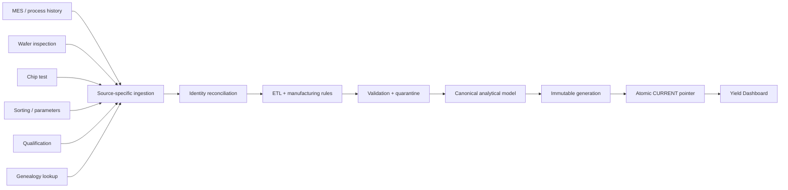
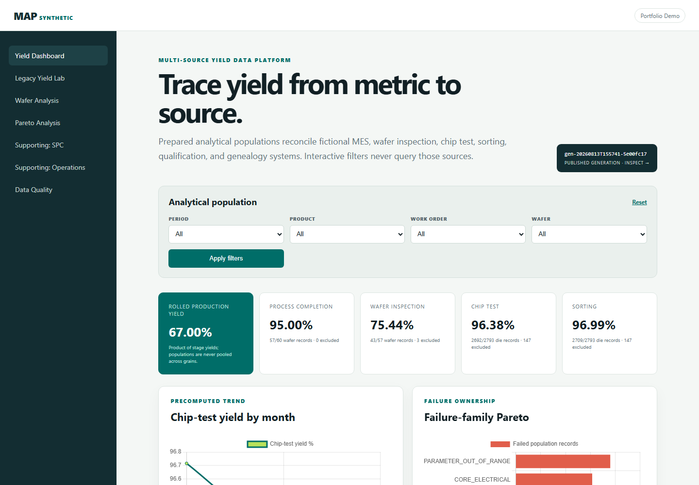

# Manufacturing Analytics Platform

A synthetic semiconductor manufacturing data platform that integrates multiple heterogeneous production systems into a continuously refreshed analytical model used by an interactive yield-investigation application.

Every system, identifier, distribution, process name, rule, screenshot, and record in this repository is fictional. The implementation is clean-room and contains no employer code, schemas, SQL, credentials, business rules, or production data.

## The problem

A useful yield application cannot repeatedly reconstruct manufacturing truth from operational systems every time a user changes a filter. Those systems have different identifiers, grains, clocks, revisions, and purposes. This project treats the dashboard as the consumer of a data platform:



Normal dashboard interaction opens only the latest immutable analytical generation in read-only mode. Source extraction and manufacturing transformation occur during refresh, not during HTTP requests.



## What the platform demonstrates

- Six separate SQLite source systems with deliberately different schemas and data grains
- Substrate aliases, inspection aliases, and composite work-order/lot + wafer identities
- Explicit resolved, unresolved, ambiguous, and fallback reconciliation outcomes
- Duplicate records, late arrivals, revised results, missing identifiers, incomplete routes, inconsistent date formats, and non-production populations
- Configuration-driven process-family, failure-family, completion, specification, and exclusion rules
- Wafer- and die-grain denominators that are never silently pooled
- Immutable analytical generations, source watermarks, validation metadata, and atomic publication
- Known-good fallback when a refresh fails
- Metric → population → wafer/die → synthetic source-record lineage
- Date/week/month trends, stage yields, Pareto and outlier analysis, wafer drill-down, CSV population export, and generation inspection
- Supporting wafer maps, SPC, operations, query instrumentation, tests, logging, and CI retained from earlier iterations

## Synthetic sources

| Source | Grain | Native identity | Intentional teaching cases |
| --- | --- | --- | --- |
| MES | Process event | lot + wafer, sometimes substrate | missing substrate, incomplete route, naming variants |
| Wafer inspection | Wafer observation | inspection alias | duplicate and revised inspection, non-ISO dates, unresolved alias |
| Chip test | Die result | substrate + device | late arrival, die-level failures |
| Sorting | Die parameter | work order + wafer sequence + device | specification-based pass/fail |
| Qualification | Sample result | lot + wafer | retained context excluded from production yield |
| Genealogy | Alias mapping | heterogeneous aliases | composite resolution and ambiguous alias example |

The adapters in `pipeline/sources.py` know only their own source. No cross-source mega-query exists.

## Manufacturing transformations

Fictional rules in `config/transformation_rules.toml` demonstrate domain decisions rather than generic joins:

- Normalize `ETCH-A` and `ETCH ALPHA` into one process family.
- Require the configured final process family for production completion.
- Retain the latest inspection revision and classify the earlier row as superseded.
- Map source failure codes and labels into canonical failure families.
- Apply wafer-inspection acceptance at wafer grain and parameter limits at die grain.
- Exclude incomplete wafers from downstream production denominators.
- Retain qualification records for context while excluding them from production yield.
- Assign a normalized analytical month and preserve the source record behind every output row.

The headline rolled yield is the product of conditional stage yields. It is not a ratio formed by mixing wafer and die records.

## Analytical generations and failure recovery

A refresh extracts every source, reconciles identities, transforms records, builds the canonical population, writes lineage and quality dispositions, validates the database, and only then publishes it. Generation databases are immutable. Publication renames the completed file and atomically replaces a small `CURRENT` pointer.

If extraction, reconciliation, transformation, loading, or validation fails, the building file is removed and `CURRENT` remains unchanged. Readers continue to serve the previous known-good generation.

The included `ScheduledRefresh` is a testable scheduling seam. A production deployment would call the same idempotent pipeline from a dedicated worker or platform scheduler, never from a user filter request.

## Repository structure

```text
config/                         Transformation and generation configuration
src/manufacturing_analytics/
  pipeline/                     Source adapters, identity, ETL, generations
  data/                         Read-only analytical and legacy repositories
  analytics/                    Dashboard use-case orchestration
  domain/                       Synthetic generation, statistics, SPC
  services/                     Application bootstrap boundaries
  web/                          FastAPI routes, templates, local assets
  scripts/                      Data generation and staged benchmarks
tests/                          Behavioral and component tests
docs/                           Architecture, model, walkthrough, performance
```

## Technology choices

- **Python 3.11+** for the application and pipeline
- **SQLite** for separate synthetic sources and immutable analytical generations
- **FastAPI + Jinja2** for a small server-rendered investigation interface
- **Chart.js**, bundled locally, for interactive charts
- **pytest** and **Ruff** for behavioral tests and static quality gates
- **GitHub Actions** for continuous integration

SQLite is deliberate here: separate files make system ownership and atomic generation publication visible, require no external service, and keep the portfolio reproducible. DuckDB/Parquet would become attractive when columnar scans, partitioned generations, or substantially larger populations justify another runtime dependency.

## Run locally

```bash
python -m venv .venv
# Windows: .venv\Scripts\activate
# macOS/Linux: source .venv/bin/activate
python -m pip install -e ".[dev]"
uvicorn manufacturing_analytics.main:app --reload
```

Open `http://127.0.0.1:8000`. The first startup creates the source files and publishes a generation under `data/yield_platform/`; all artifacts are deterministic and ignored by Git.

```bash
pytest
ruff check .
ruff format --check .
python -m manufacturing_analytics.scripts.benchmark_pipeline
```

## Investigation workflow

1. Filter the Yield Dashboard by analytical month, product, work order, or wafer and choose date/week/month trend aggregation.
2. Compare stage yields without mixing their population grains.
3. Inspect the failure-family Pareto and chip-test trend.
4. Open a stage to inspect or export its precise denominator.
5. Open a canonical wafer to see source-system keys and transformation notes.
6. Open the generation badge to inspect watermarks, row counts, warnings, and dispositions.

See [the end-to-end wafer walkthrough](docs/PIPELINE_WALKTHROUGH.md), [architecture](ARCHITECTURE.md), [data model](docs/DATA_MODEL.md), [measured performance](docs/PERFORMANCE.md), and [roadmap](ROADMAP.md).

## Scope and limitations

This is a portfolio-scale reference implementation, not a fab execution system. It uses local files, one refresh process, modest synthetic volumes, and simplified fictional yield rules. It does not claim equipment utilization, causal failure attribution, real-time ingestion, or production-grade distributed coordination. Those omissions are documented design boundaries rather than hidden assumptions.

Licensed under the [MIT License](LICENSE).
