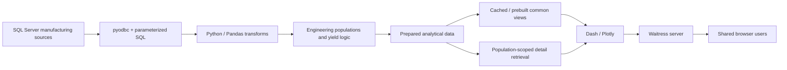

# Manufacturing Analytics Platform

> **Explore the complete portfolio:** This is the runnable Yield flagship. For the
> broader manufacturing software story—including process analytics, Lean digital
> operations, and application delivery—visit the
> [Manufacturing Software Portfolio](https://github.com/4sy8zwp9hz-netizen/manufacturing-software-portfolio).

This clean-room project recreates the architecture and engineering lessons of a semiconductor
manufacturing Yield Dashboard I developed in a production environment. The original system grew
from SQL/Python engineering analysis into a centrally hosted, automatically refreshed
manufacturing application as adoption, dataset size, query latency, and deployment requirements
increased.

This public version contains only synthetic data and independently written code. It reproduces
the major architectural patterns, user workflow, information density, and engineering tradeoffs
of the real system without publishing employer code, SQL, schemas, identifiers, infrastructure,
business rules, or data.



The runnable public path substitutes a deterministic synthetic source adapter for the unavailable
production database. The Pandas transformation, prepared-data, refresh, caching, drilldown, and UI
layers remain the architectural story.


## The manufacturing problem

Raw production records do not directly equal an engineering yield metric. Different sources can
identify the same physical wafer differently, arrive at wafer or chip grain, use different event
dates, contain revisions, and represent different populations. A summary must still explain:

- which physical wafers were eligible;
- which date placed each record in a reporting period;
- which denominator was used by each row;
- which failures caused the loss;
- which source-derived rows contributed to the result.

The project therefore models the path from source-shaped records to a defensible analytical
population—not merely a collection of charts.

## What the application demonstrates

- A table-first, information-dense Yield review modeled on a repeatedly used engineering workflow
- Wafer-process, inspection, automated-screening, Sorting, qualification, and final-chip rows
- Exact and normalized physical-wafer identity resolution with explicit ambiguity handling
- Revision-aware and source-date-aware Pandas transformation
- Qualification-cohort final yield with complete components and quantity weighting
- Selected-cell investigation through Pareto, trend, physical-wafer scatter, lineage, and export
- Common in-memory analytical data, separately preloaded expensive analysis, and targeted detail
- Validated Parquet generations with manifests, compatibility checks, and atomic publication
- Background refresh, generation hot reload, and previous-known-good behavior after failure
- Dash/Plotly presentation and Waitress hosting with a portal-ready application factory
- JSON-driven display, identity, cohort, runtime, and refresh behavior


## Two connected evolution tracks

The project did not advance primarily through visual redesign. The investigation workflow remained
recognizable because it already matched how engineers reviewed Yield. Most later improvement
happened beneath that interface in two connected tracks.

### Yield data and service evolution

| Observed limitation | Engineering response | Capability gained |
| --- | --- | --- |
| Source rows did not represent defensible Yield populations | SQL retrieval plus Pandas identity, revision, date, and cohort transformation | Traceable analytical facts |
| Broad queries and callback calculations grew with history | Scope expensive retrieval before transfer and reuse shared server state | Lower source load and faster common interactions |
| Common and specialized workloads competed during startup | Separate common facts, expensive reusable preloads, and targeted high-volume detail | Workload-specific latency and memory control |
| Repeated source reconstruction continued across users | Build validated Parquet facts through scheduled ETL | Prepared data shared across sessions |
| Full rebuilds made freshness expensive | Add incremental, correction-aware refresh paths where the source grain allowed them | More efficient historical maintenance |
| Data contracts and caches changed over time | Version prepared pipelines and invalidate incompatible cache state | Safer application and data evolution |
| Refreshes, concurrent polling, or oversized caches could affect availability | Add atomic publication, last-known-good retention, synchronization, batching, and bounds | More fault-tolerant service behavior |

### Application distribution evolution

| Adoption stage | Delivery response | Operational capability gained |
| --- | --- | --- |
| One engineer used a local application | Package and version repeatable releases | A usable tool could be shared |
| Installed copies drifted and updates were difficult | Introduce shared configuration and centralized application access | More consistent releases and discovery |
| Multiple applications each assumed they owned a listener | Refactor to portal-ready application factories and mounted WSGI routes | Several applications could share one entry point |
| Browser users depended on the service | Add a central Windows host, Waitress, health checks, logs, restart commands, and watchdog behavior | A supportable operating model |

These tracks reinforced one another. Central hosting removed duplicated per-user work, while the
prepared-data architecture made centralized use practical. The detailed chronology is in
[Engineering Evolution](docs/ENGINEERING_EVOLUTION.md), and the broader hosting progression is in
[Deployment Evolution](docs/DEPLOYMENT_EVOLUTION.md).

## Three data-access strategies

The code intentionally does not treat every dataset alike.

| Workload | Public implementation | Reason |
| --- | --- | --- |
| Common Yield population | Loaded during refresh, transformed with Pandas, published in Parquet, then held in memory | Used by normal filters and table interactions |
| Expensive but common Sorting analysis | Detail remains persisted while a separate background cycle builds reusable parameter summaries | Avoids making the common snapshot wait for a specialized workload |
| High-volume chip/parameter detail | Read only for the physical wafer selected in the investigation | Avoids preloading unrelated rows merely to make one drilldown fast |

See [Data Flow](docs/DATA_FLOW.md) and [Performance Evolution](docs/PERFORMANCE_EVOLUTION.md).

## Repository structure

```text
config/
  default.json               runtime, storage, refresh, and display settings
  yield_rules.json           fictional identity, cohort, and row definitions
src/manufacturing_analytics/
  sources.py                 synthetic substitute and optional SQL Server boundary
  transforms.py              identity, population, yield, and lineage logic
  storage.py                 Parquet generations and targeted detail reads
  runtime.py                 snapshots, refresh, preload, and hot reload
  yield_analytics.py         in-memory tables, figures, and drilldown views
  application.py             Dash layout and callbacks
  bootstrap.py               explicit service composition and background loops
  main.py                    Waitress entry point
tests/                       behavioral and failure-path contracts
tools/capture_screenshots.py browser capture from the running application
docs/                        architecture and engineering evolution documents
```

The package structure is deliberately small. It separates work that changes for different
reasons without introducing a framework of unnecessary interfaces.

## Run locally

Python 3.11 or newer is required.

```powershell
py -m venv .venv
.venv\Scripts\Activate.ps1
python -m pip install -e ".[dev]"
python -m manufacturing_analytics.scripts.refresh_data
python -m manufacturing_analytics.main
```

Open `http://127.0.0.1:8050`.

The server loads the most recent valid generation. If no generation exists, it creates one from
the synthetic adapter. Generated files live beneath `data/yield_runtime/` and are ignored by git.

## Exercise the workflow

1. Filter the summary by product, work order, wafer size, date, or period grain.
2. Select a period cell in a Yield row.
3. Choose **Enhance**.
4. Inspect the selected-period Pareto and the full-range trend.
5. Select a physical wafer in the scatter plot.
6. Confirm that only that wafer's chip or Sorting detail is retrieved.
7. Export the exact selected analytical population.
8. Choose **Refresh data** and watch the existing screen remain usable during refresh.

## Verification

```powershell
python -m pytest
python -m ruff check .
python -m ruff format --check .
```

The tests cover reproducibility, source grains, identity ambiguity, revisions, cohort consistency,
quantity weighting, lineage, Parquet validation, atomic publication, injected refresh failures,
known-good fallback, separate Sorting preload behavior, population-scoped detail, Dash layout, and
health reporting.

## Production pattern versus public accommodation

| Classification | What it means here |
| --- | --- |
| Direct analogue of completed work | SQL Server/`pyodbc` boundary, Pandas transformations, Dash/Plotly, JSON configuration, caches/preloads, background refresh, Parquet preparation, targeted retrieval, Waitress, portal mounting pattern, and failure-tolerant snapshots |
| Documented production evolution | Incremental and correction-aware refresh, pipeline-version cache invalidation, and later batching, polling, and memory hardening are verified parts of the engineering history; this repository explains them without fabricating production scale or private implementation details |
| Public-demo accommodation | Deterministic synthetic source records replace inaccessible production SQL sources |
| Future design | A real SQL Server deployment of this public code, multi-process cache coordination, and additional sanitized workflows are not claimed as completed public features |

No SQLite, FastAPI, Jinja application, Redis, PostgreSQL, DuckDB, Docker, Kubernetes, cloud service,
microservice system, or AI feature is part of the flagship architecture.

## Engineering documentation

- [Architecture](ARCHITECTURE.md) — system structure and layer boundaries
- [Yield Calculation Model](docs/YIELD_CALCULATION_MODEL.md) — manufacturing-domain logic and calculation rules
- [Engineering Evolution](docs/ENGINEERING_EVOLUTION.md) — the sequence of problems and design decisions
- [Performance Evolution](docs/PERFORMANCE_EVOLUTION.md) — workload-specific performance strategies
- [Deployment Evolution](docs/DEPLOYMENT_EVOLUTION.md) — the path from local tooling to centralized hosting
- [Engineering Terminology](docs/ENGINEERING_TERMINOLOGY.md) — standard terms for the implemented concepts
- [Truthfulness Audit](docs/TRUTHFULNESS_AUDIT.md) — exact claim classification

## Clean-room boundary

All source names, manufacturing identifiers, products, stages, failure categories, dates, values,
configuration rules, and screenshots in this repository are fictional. The private applications
were used only to identify architectural patterns, user workflows, performance decisions, and
engineering lessons. No private implementation was copied.

## License

[MIT](LICENSE)
