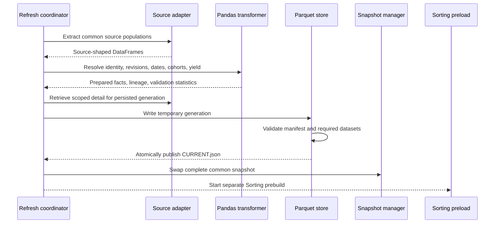
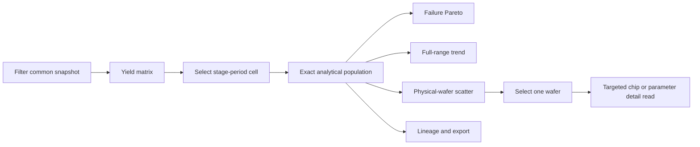

# Data Flow

This document answers: **“What happens from source retrieval to a selected dashboard cell?”**

## Production-inspired and public paths

```text
Production-inspired path
SQL Server -> parameterized pyodbc pulls -> source-shaped DataFrames

Runnable public path
deterministic synthetic adapter -> the same source-shaped DataFrame contract
```

The synthetic adapter is a reproducibility accommodation. It is not presented as the architecture
of the original system.

## Refresh path



If any extraction, transformation, write, or validation stage fails, publication does not occur and
the active snapshot remains available.

## Synthetic source complexity

| Fictional source domain | Grain | Distinct behavior |
| --- | --- | --- |
| Wafer inventory/process | wafer and operation | work-order/lot identity and completion dates |
| Wafer inspection | wafer and site summary | separate inspection alias and record revisions |
| Chip inspection | chip and wafer summary | chip grain, coordinates, failure family, latest revision |
| Sorting | wafer summary and parameter result | process date differs from generated date; high detail volume |
| Qualification | physical wafer and channel | defines final-yield cohort membership |
| Alias inventory | source alias to physical wafer | exact, normalized, ambiguous, and unresolved cases |

## Prepared datasets

| Dataset | Load policy | Use |
| --- | --- | --- |
| `yield_fact` | common in memory | matrix, trends, populations, scatter |
| `failure_fact` | common in memory | selected-period and prebuilt Pareto |
| `wafer_summary` | common in memory | physical-wafer overview |
| `final_component_fact` | common in memory | final cohort audit |
| `lineage` | common in memory | source and transformation explanation |
| `identity_audit` | common in memory | reconciliation dispositions |
| `prebuilt_trend` / `prebuilt_pareto` | common in memory | refresh-time reusable views |
| `targeted_chip_detail` | persisted, targeted read | selected wafer's chip results |
| `targeted_sorting_parameter_detail` | persisted, targeted/preload | separate parameter summary and selected-wafer detail |

## Interaction path



The browser stores the selected context and opaque component state; complete analytical DataFrames
remain on the server.
