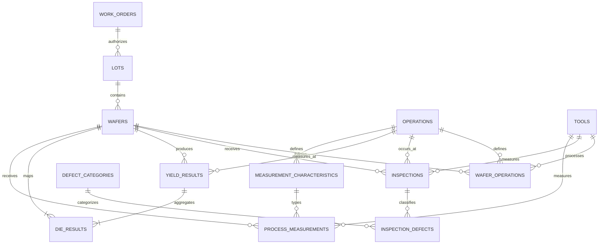

# Synthetic data model

The model represents a simplified wafer-manufacturing genealogy. It is entirely fictional and is not derived from an employer, fab, product, MES, test, or inspection system.

## Entity intent

- **Work orders** describe an authorized quantity for a fictional product.
- **Lots** are processing groups assigned to a work order and route.
- **Wafers** are the primary traceable units within a lot.
- **Operations** define the ordered manufacturing route.
- **Tools** identify equipment capable of a tool-group function.
- **Wafer operations** record wafer-level processing history and tool traceability.
- **Inspections** summarize a measurement event at an operation and tool.
- **Inspection defects** break inspections down by fictional defect classification.
- **Yield results** store aggregate good die, tested die, and wafer-level weighted yield.
- **Die results** store unique wafer coordinates, pass/fail status, and a fictional test bin. Each row references both its wafer and aggregate yield result.
- **Measurement characteristics** define a fictional continuous metric, unit, operation, and optional engineering specification limits.
- **Process measurements** store time-ordered wafer values, measurement timestamps, tool exposure, and source-arrival timestamps.
- **Source watermarks** describe the latest source state incorporated, the observation time, row count, and source-specific lag objective.
- **Data-quality issues** retain severity, affected entity, detection time, and human-readable evidence for synthetic completeness, sequence, latency, duplication, measurement, and freshness findings.

## Integrity rules

The SQLite schema enforces parent relationships, unique wafer coordinates, unique route events, valid pass/fail values, non-negative counts, and yields between zero and one. The generator calculates `yield_results.good_die` directly from the coordinate rows; it does not independently invent an aggregate that could disagree with the map.

The default 21-by-21 coordinate grid includes points inside a radius of ten, producing 317 tested sites per wafer. With 60 wafers, the representative dataset contains 19,020 coordinate results.

The default dataset also contains 178 process measurements across three fictional characteristics. One intentionally omitted characteristic result and one intentionally omitted route event make completeness behavior testable.

## Embedded fictional signals

The generator uses a configured pseudo-random seed, so every signal is reproducible. A small subset of wafers receives one of these teaching patterns:

- elevated failures near the wafer edge;
- a localized failure cluster;
- increased spatially random loss;
- approximately uniform high yield.

The fictional `ETCH-02` exposure also introduces a modest yield penalty. Lot and wafer noise prevent every comparison from looking mechanically perfect. These effects create hypotheses worth investigating; they are not claims about real semiconductor processes, and correlation in the dashboard does not establish causation.

Continuous measurements add independently fictional stable common-cause variation, a temporary mean shift, increased variation on one tool/time cohort, a tool offset with gradual drift, delayed arrivals, and one isolated special-cause outlier. The values and specification limits are teaching constructs, not process recipes or real engineering requirements.
