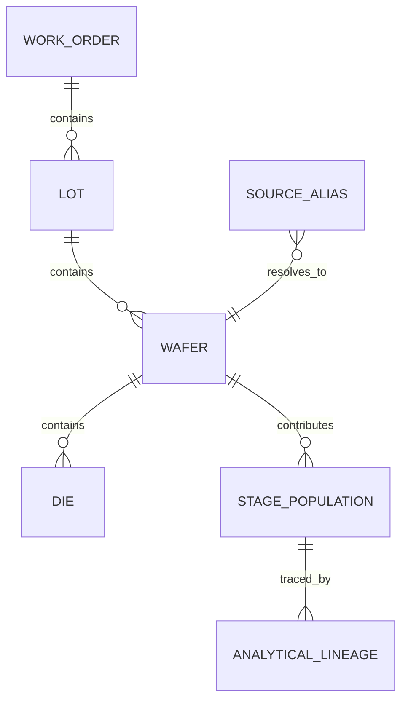

# Data model

## Source models

The project intentionally has no universal source primary key.

| Source | Key examples | Grain |
| --- | --- | --- |
| Genealogy | alias type + alias value | alias-to-canonical mapping |
| MES | event key; lot + wafer; optional substrate | process event |
| Wafer inspection | inspection record + revision | wafer observation |
| Chip test | measurement key; device + coordinates | die test |
| Sorting | order + wafer sequence + device | die parameter |
| Qualification | qualification record; lot + wafer | sampled context |

## Canonical identity



`canonical_wafers` materializes work order, lot, wafer, product, analytical period, route-completion state, and production eligibility. Die identity remains in each stage row's unit key because not every source supplies the same device identifier.

## Analytical generation

### `generation_metadata`

One record identifies the immutable generation, refresh start/end, validation/publication state, and warning count.

### `source_watermarks`

Records the source name, physical synthetic file, and extracted row count. A production adapter would add source-native change sequence or maximum arrival timestamp.

### `canonical_wafers`

One canonical wafer with its hierarchy and population eligibility.

### `stage_population`

One analytical unit for a stage. Key semantics:

- `population_unit`: wafer, die, or sample grain.
- `is_denominator`: whether the unit participates in that stage yield.
- `is_good`: outcome; meaningful independently of exclusion for audit.
- `failure_family`: canonical classification assigned by transformation.
- `exclusion_reason`: why a visible record did not enter production yield.
- coordinates: populated for die-level mapping where available.

Stage yield is always `SUM(is_good WHERE is_denominator) / SUM(is_denominator)` within one stage. Rolled yield multiplies conditional stage yields; it never sums unlike grains.

### `analytical_lineage`

Links an analytical record to its fictional source system/table/key plus reconciliation and transformation explanations. The current model emits one lineage record per population record, while the schema supports multiple contributors.

### `transformation_issues`

Captures source key, issue type, disposition, and evidence. Records may be resolved with fallback, superseded, included with warning, or quarantined.

## Example identity paths

```text
MES: SUB-700001                 ─┐
Wafer inspection: WI-LOT...-01 ─┤
Chip test: SUB-700001           ├→ WAF-000001 → LOT-001-01 → WO-001
Sorting: WO-001 + sequence 1    ─┤
Qualification: LOT-001-01 + 1   ─┘
```

The mapping is synthetic and exists to teach reconciliation behavior, not to imitate any production naming convention.
