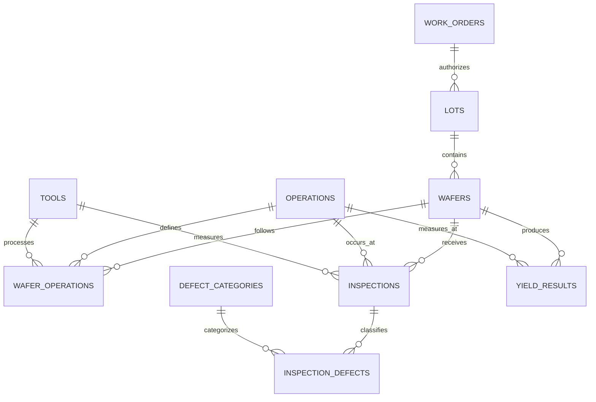

# Synthetic data model

The model represents a simplified wafer-manufacturing genealogy. It is intentionally fictional and is not derived from any employer, fab, product, MES, or inspection system.

## Entity intent

- **Work orders** describe an authorized quantity for a fictional product.
- **Lots** are processing groups assigned to a work order and route.
- **Wafers** are the primary traceable units within a lot.
- **Operations** define the ordered manufacturing route.
- **Tools** identify equipment capable of a tool-group function.
- **Wafer operations** record wafer-level processing history and provide tool traceability.
- **Inspections** summarize a measurement event at an operation and tool.
- **Inspection defects** form a many-to-many breakdown between inspections and defect categories.
- **Yield results** store numerator, denominator, and calculated wafer-level yield at a measurement operation.

The generator introduces small fictional lot, wafer, and tool effects so future dashboards have patterns worth investigating. These effects are pedagogical, not claims about real process behavior.

