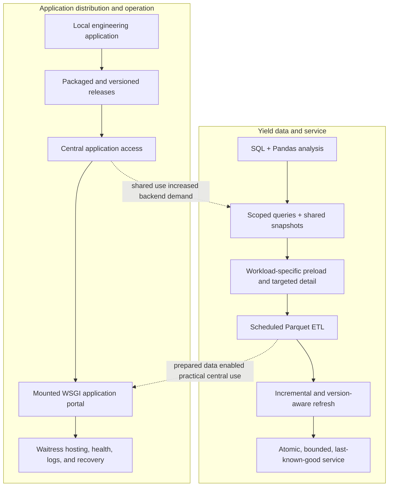

# From Engineering Analysis to Manufacturing Software

This document connects each architectural change to the operational or engineering problem that
motivated it.

The final architecture was not designed at the beginning. Each useful solution increased adoption
or scope, which exposed the next limitation.

## Two evolution tracks at a glance



The tracks are related but not interchangeable. Yield evolved as a data product and long-running
service. Distribution evolved as a reusable way to release, host, discover, monitor, and recover
multiple manufacturing applications. Keeping them separate makes the scope of each improvement
clear without pretending that the portal itself performs Yield ETL.

## Yield backend iterations in practice

The stable table-to-drilldown workflow can make the application look visually similar across
releases. Underneath it, the backend changed repeatedly as correctness, history, and adoption
exposed new constraints.

| Iteration | Pressure that exposed it | Backend change | Engineering growth demonstrated |
| --- | --- | --- | --- |
| Establish the calculation | Heterogeneous records did not share an analytical grain | Normalize identities, revisions, stage dates, cohorts, and denominators in Pandas | Domain modeling and ETL correctness |
| Narrow the source work | Small investigations still triggered broad retrieval | Resolve the population first and apply bounded, parameterized SQL predicates | Query planning and source-load control |
| Reuse common state | Callbacks and users repeated the same transformations | Load a shared server snapshot and cache reusable analytical indexes | State ownership and memoization |
| Separate workloads | Common views waited for unusually expensive analysis | Give expensive reusable analysis its own preload while keeping large detail lazy | Eager/lazy design and resource isolation |
| Materialize prepared facts | Shared use still rebuilt broad source history | Publish validated Parquet facts on a schedule | Server-side ETL and analytical materialization |
| Refresh incrementally | Complete historical rebuilds became increasingly wasteful | Reconcile new and corrected source records at their natural grain | Incremental processing and correction handling |
| Evolve the data contract | Transformation changes could leave plausible but incompatible caches | Version pipeline outputs and rebuild state when compatibility changes | Cache invalidation and schema evolution |
| Protect availability | A failed or overlapping refresh could disturb a valid view | Build separately, synchronize publication, and retain the last complete generation | Concurrency and fault-tolerant refresh |
| Harden production behavior | Batching, polling, and memory edge cases appeared under continued use | Bound caches, batch appropriate reads, prevent overlapping work, and normalize late data variations | Operational debugging and defensive design |

This sequence is more important than any individual library choice. It shows a progression from
writing a correct analysis to owning the data lifecycle, performance envelope, concurrency, and
failure behavior of a shared analytical service.

## 1. Getting the right data

**Problem.** Manufacturing information existed across operational sources but not at the grain,
identity, or population needed to answer Yield questions.

**First solution.** Learn SQL Server retrieval, combine source-specific records, and use Python and
Pandas to normalize identifiers, dates, fields, and manufacturing interpretations.

**New limitation.** A correct one-time analysis still had to be reconstructed manually.

**Resulting concepts.** SQL retrieval, transformation, normalization, joins, ETL, analytical
population, and data grain.

**Public analogue.** The synthetic sources intentionally cannot produce the final Yield table
without identity resolution, revision handling, date interpretation, and cohort construction.

## 2. Turning analysis into a reusable application

**Problem.** Engineers needed to repeat filters, trend analysis, Pareto review, and wafer-level
investigation without rebuilding notebooks or scripts.

**Solution.** Build interactive Dash/Plotly applications around established Pandas calculations.

**New limitation.** More workflows and changing engineering rules increased callback, state, and
configuration complexity.

**Engineering change.** Reuse calculation functions, make populations explicit, move changing
rules into shared JSON, and keep summary values traceable to detail rows.

**Resulting concepts.** Application state, callback design, separation of concerns,
configuration-driven behavior, and traceability.

## 3. Adoption created a distribution problem

**Problem.** A useful application on one engineering workstation did not automatically become a
maintainable application for other users.

**Early response.** Package Python applications, maintain stable filenames, publish versioned
releases, and use shared configuration and documentation.

**New limitation.** Multiple installed copies made updates, compatibility, and repeated local data
work difficult to control.

**Engineering change.** Progress toward centralized application distribution and eventually a
common application portal.

**Resulting concepts.** Packaging, release management, version management, manifests, software
distribution, and configuration management.

## 4. Startup time and interaction latency

**Problem.** Broader populations and specialized analyses made synchronous startup and repeated
callback computation too slow. Treating every dataset identically also increased database load.

**Changes made in sequence.**

1. Restrict expensive SQL to relevant work orders and wafers.
2. Replace inefficient source-query patterns and perform suitable classification in Pandas.
3. Load common datasets once per server snapshot.
4. Cache alias resolution and frequently reused analytical views.
5. Prebuild common charts and table ranges outside the click path.
6. Keep specialized detail lazy when its volume does not justify startup loading.
7. Give unusually expensive Sorting and inspection datasets independent preload behavior.
8. Preserve the visible page while background calculations or refreshes complete.

The lesson was not merely “add caching.” It was to identify the population, cost, reuse rate, and
latency requirement of each workload.

**Resulting concepts.** Query scoping, predicate reduction, eager loading, lazy loading,
precomputation, memoization, workload separation, and non-blocking UX.

## 5. Moving from desktop applications to shared server software

**Problem.** Desktop distribution and per-user processing limited scale and made maintenance harder.

**Solution.** Establish a Windows-hosted internal service, convert local-only application behavior
to server-safe behavior, mount multiple Dash WSGI applications beneath a Flask portal, and serve the
combined application with Waitress.

**Operational hurdles.** The work required coordination around domain membership, stable network
addressing, firewall and security policy, SQL permissions, shared-file permissions, persistent
execution, logging, health checks, and restart behavior.

The accurate role statement is: **worked with IT to resolve the enterprise infrastructure and access
requirements necessary to operate the applications.** This portfolio does not claim ownership of
the enterprise network.

**Resulting concepts.** Client/server architecture, WSGI composition, centralized hosting,
networking, deployment, health monitoring, and operational ownership.

## 6. Moving repeated work into server-side preparation

**Problem.** Shared users still should not repeatedly perform the same broad SQL extraction and
manufacturing transformation.

**Solution.** Separate expensive scheduled work from fast interactive work:

- retrieve broad common source data on a refresh cycle;
- transform and validate it once on the server;
- publish prepared Parquet generations;
- preload common and expensive reusable views;
- retain targeted retrieval for high-volume detail;
- hot-load new generations into the running dashboard.

**Reliability change.** A failed refresh retains the previous in-memory snapshot and published
generation. Users see a warning rather than an empty application.

**Resulting concepts.** Server-side ETL, materialization, snapshots, immutable generations, atomic
publication, fault-tolerant refresh, and last-known-good behavior.

## A stable workflow supported backend evolution

Earlier interaction patterns could effectively be:

```text
click -> broad calculation/query -> loading or blank screen -> result
```

Later patterns became:

```text
background/prebuilt population -> click -> cached view -> preserve current screen
```

That change connected user experience to data architecture. Faster interactions did not come from
visual styling; they came from moving work out of the click path. Preserving the familiar
table-to-drilldown workflow also reduced disruption for users while query, cache, ETL, and refresh
internals continued to change.

## Broader application ecosystem

The Yield Dashboard is the flagship data/software story. Other applications informed separate
lessons without being fabricated into one product:

- a factory-status display emphasized visual management and reliable background caches;
- a passdown workflow emphasized standardization, server-side reuse, preview, and submission safety;
- SPC tools emphasized daily snapshots, bounded server caches, and statistical monitoring;
- a process-analytics application demonstrated that useful software sometimes requires defining
  new structured manufacturing-data requirements upstream.

Where another database or MES team implemented source-system changes, the truthful statement is
that application requirements were defined, requested, validated, and integrated collaboratively.

## Central lesson

The career story is not “designed a textbook data platform.” It is:

> Repeatedly encountered manufacturing and software constraints, solved them, and gradually evolved
> individual engineering tools into production manufacturing software systems.
